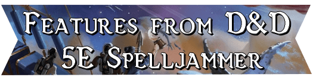

# Features from DnD 5E Spelljammer

[Nexus](https://www.nexusmods.com/baldursgate3/mods/13195) - [Source](https://github.com/valsan-azerty-boi/BG3-MOD-Spjm)

Features from DnD 5E Spelljammer is unofficial Fan Content permitted under the Fan Content Policy. Not approved/endorsed by Wizards. Portions of the materials used are property of Wizards of the Coast. ©Wizards of the Coast LLC.

Features from DnD 5E Spelljammer is a mod for Baldur's Gate 3, a game developed and published by Larian Studios. This mod is not affiliated with, endorsed by, or approved by Larian Studios. Baldur’s Gate 3 and all related assets, trademarks, and copyrights are the property of Larian Studios.

## License Notice
This project is licensed under the [Creative Commons Attribution-NonCommercial 4.0 International (CC BY-NC 4.0)](https://creativecommons.org/licenses/by-nc/4.0/).

For example, if you reuse any of the project's content, you must credit the original authors and remember that commercial use is NOT allowed under this license.

For full details, please check the [LICENSE](./LICENSE) file or visit the [Creative Commons website](https://creativecommons.org/licenses/by-nc/4.0/).

The project itself is completely open to contributions.

## Features
This mod implements features from the D&D 5E Spelljammer sourcebooks into Baldur's Gate 3. These mechanics have been adapted to better match the way the game works. Contains backgrounds, goals, spells, items, bestiary, etc.

## Languages
- English 
- French
- Russian (by [Hecctus](https://next.nexusmods.com/profile/Hecctus))
- Korean (by [yoonmoonsick](https://next.nexusmods.com/profile/yoonmoonsick))

## Voice actors
- [Miel the cat](https://next.nexusmods.com/profile/cadelach)
- Antw Morty
- xoktoberkindx
- kilroyrequiem4evr
- [Anthony Picman](mailto:picmandmwork@gmail.com)
- DavidKouw
- kamiko
- [Kailiana](https://next.nexusmods.com/profile/kailiana)
- [bibsan](https://next.nexusmods.com/profile/bibsan)

## Special thanks
- The entire BG3 modding community
- And Larian for this amazing game

## External CC credits
- Asteroid 3D model from [admone](https://sketchfab.com/3d-models/asteroid-80a70567fb2a42df836e6d70204e0b68)
